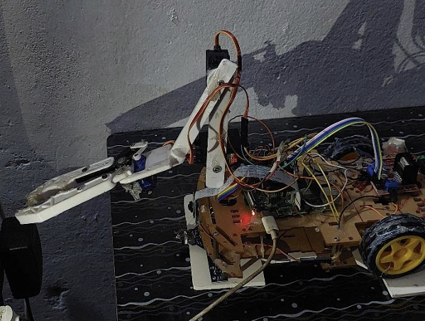
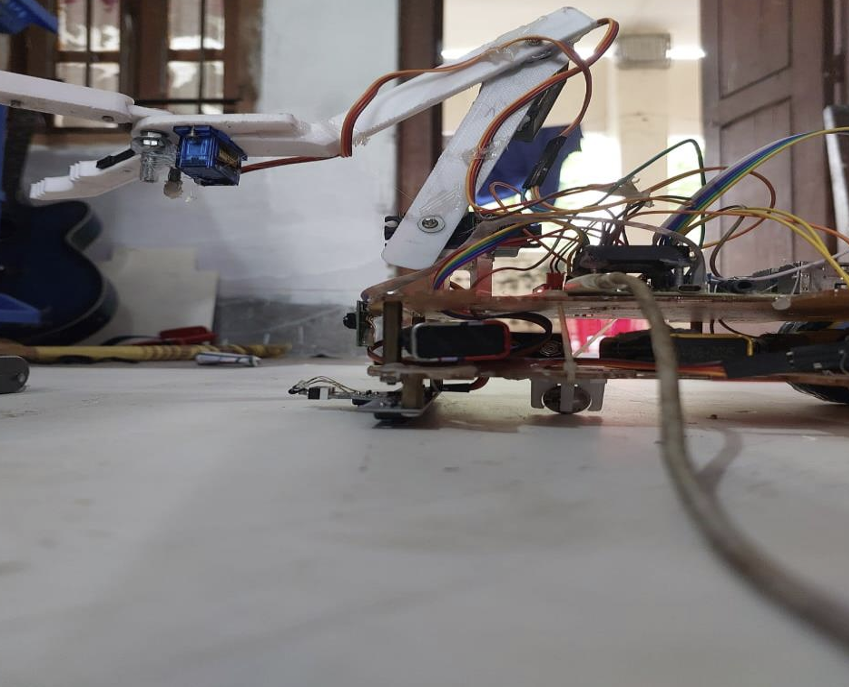
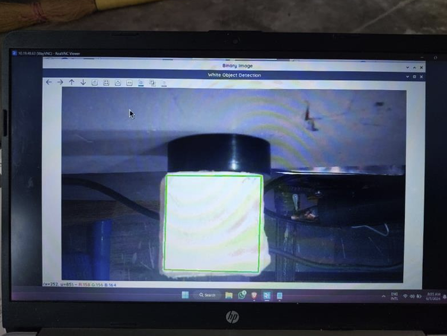
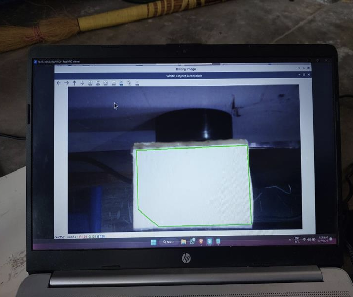

# Image Processing Based Object Sorting Robot (Raspberry Pi)

A Raspberry Pi–based robot that detects **white square vs. white rectangle** using **OpenCV** and a **Pi Camera**, then sorts objects using a **3-servo gripper** and turning motion via **DC motors**.

## How it works
1. Capture image from Pi Camera  
2. Convert to grayscale + threshold  
3. Find contours and compute bounding box aspect ratio  
4. Classify: **square** or **rectangle**  
5. Pick with gripper and place by turning left/right  

## Repository Structure
- `src/` — Python code (`main.py`)
- `assets/photos/` — hardware/build photos
- `assets/results/` — detection result screenshots
- `wiring/` — wiring notes and pinout (`pinout.md`)

## Requirements
- Raspberry Pi + Pi Camera  
- Python 3, OpenCV, NumPy  
- `RPi.GPIO` and `picamera2` (Raspberry Pi OS)

## Run (Raspberry Pi)
```bash
sudo apt update
sudo apt install -y python3-opencv python3-picamera2
pip3 install -r requirements.txt
python3 src/main.py
```
Press **q** to quit.

## Results





## Wiring
See `wiring/pinout.md`.

## Notes (Tuning)
If detection is unstable, tune these in `src/main.py`:
- `THRESH`, `MIN_AREA`, `MAX_DISTANCE_FROM_CENTER`
- aspect ratio limits for square/rectangle
